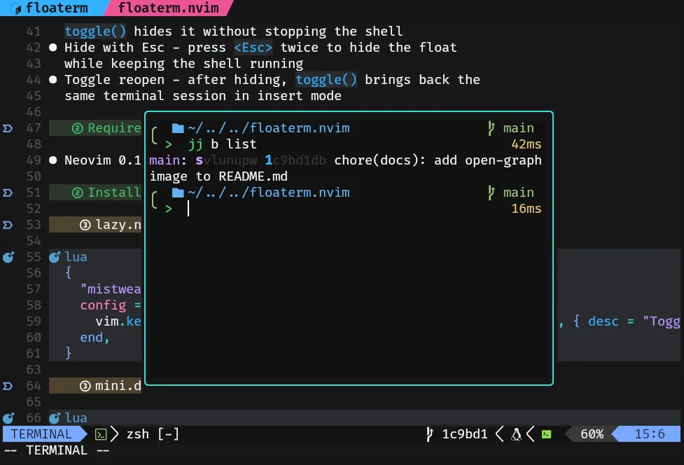

<div align="center">


# floaterm.nvim

[![Made with love][badge-made-with-love]][contributors]
[![Discord][badge-discord]][discord]

[What?](#what) •
[Installation](#installation) •
[Setup](#setup) •
[Usage](#usage) •
[API](#api)

<p></p>

A minimal Neovim plugin that provides a single floating terminal.

<p></p>



</div>

## What

`floaterm.nvim` manages one persistent terminal buffer
in a centered floating window.

Call `toggle()` to open it in insert mode or
hide it while keeping the shell running.

- **Toggle open** - opens a floating terminal and
  drops you into insert (terminal) mode
- **Toggle hide** - when the float is visible,
  `toggle()` hides it without stopping the shell
- **Hide with Esc** - press `<Esc>` twice to hide the float
  while keeping the shell running
- **Toggle reopen** - after hiding, `toggle()` brings back the
  same terminal session in insert mode

## Requirements

- Neovim 0.10+ (tested on 0.12)

## Installation

### lazy.nvim

```lua
{
  "mistweaverco/floaterm.nvim",
  config = function()
    require("floaterm").setup()
    vim.keymap.set("n", "<leader>ft", require("floaterm").toggle, { desc = "Toggle floaterm" })
  end,
}
```

### mini.deps

```lua
{
  source = "mistweaverco/floaterm.nvim",
  checkout = "main",
  config = function()
    require("floaterm").setup()
    vim.keymap.set("n", "<leader>ft", require("floaterm").toggle, { desc = "Toggle floaterm" })
  end,
}
```

### Manual

Clone this repo into your packpath, then load it from your config:

```lua
require("floaterm").setup()
vim.keymap.set("n", "<leader>ft", require("floaterm").toggle, { desc = "Toggle floaterm" })
```

## Setup

Call `setup()` once during startup. All options are optional.

```lua
require("floaterm").setup({
  width = 0.6,           -- fraction of editor width
  height = 0.6,          -- fraction of editor height
  border = "rounded",    -- float border style
  style = "minimal",     -- window style passed to nvim_open_win
  relative = "editor",   -- float position relative to editor
  title = nil,           -- optional window title
  title_pos = "center",  -- title position when title is set
  shell = nil,           -- defaults to vim.o.shell
})
```

## Usage

Map `toggle()` to whatever key you prefer:

```lua
vim.keymap.set("n", "<leader>ft", require("floaterm").toggle, { desc = "Toggle floaterm" })
```

### Key behavior inside the terminal

| Key | Mode | Action |
|-----|------|--------|
| `<Esc>` | Terminal (insert) | Exit to normal mode |
| `<Esc>` | Normal | Hide the float (shell keeps running) |
| `<leader>ft` (or your mapping) | Any | Hide or show the float |

To leave terminal insert mode manually, you can also use `<C-\><C-n>`.

## lualine

Add the component to any lualine section:

```lua
require("lualine").setup({
  sections = {
    lualine_x = { "branch", "floaterm", "encoding" },
    -- or with options:
    -- lualine_x = {
    --   {
    --     require("floaterm.lualine"),
    --     icons = { terminal = "", activity = "●" },
    --     colors = {
    --       visible = "#98c379",
    --       hidden = "#61afef",
    --       activity = "#e5c07b",
    --     },
    --   },
    -- },
  },
})
```

The component shows:

- a terminal icon when a floaterm session is running
- the same icon plus a highlighted activity marker when
  the float is hidden and new output arrived since it was last shown

Click the component to toggle the float.

## API

```lua
require("floaterm").setup(opts?)           -- configure the plugin
require("floaterm").toggle()               -- hide or show the floating terminal
require("floaterm").is_active()            -- true when the shell is running
require("floaterm").is_visible()           -- true when the float window is open
require("floaterm").has_unseen_activity()  -- true when hidden output arrived
```


[badge-discord]: https://mistweaverco.com/assets/badges/discord.svg
[discord]: https://mistweaverco.com/discord
[badge-made-with-love]: https://mistweaverco.com/assets/badges/made-with-love.svg
[contributors]: https://github.com/mistweaverco/floaterm.nvim/graphs/contributors
